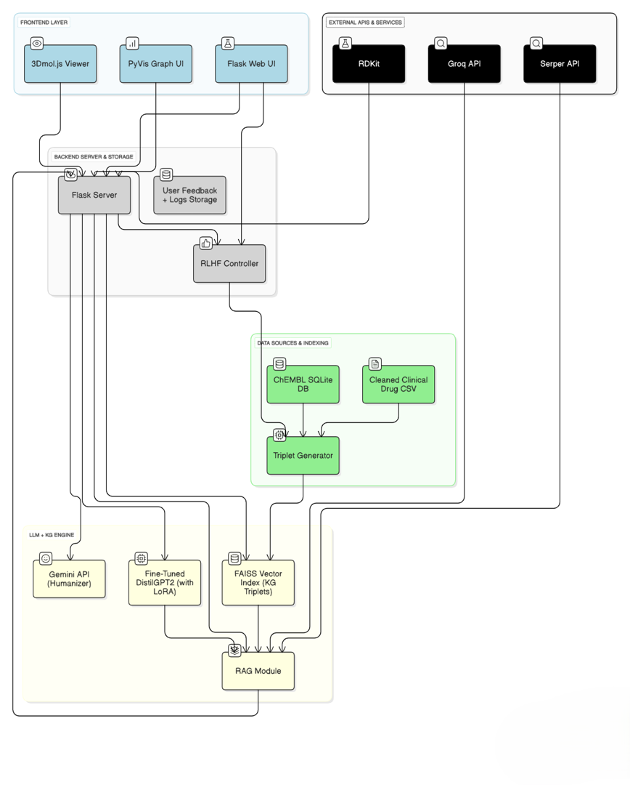

# 🧪 PharmaSage - AI-Powered Biomedical Drug Discovery Platform



PharmaSage is an integrated biomedical informatics platform designed to facilitate drug discovery, molecular comparison, and knowledge extraction from diverse biomedical data sources. It combines curated datasets, cheminformatics, knowledge graph analytics, and advanced AI-driven natural language and retrieval-augmented generation (RAG) models. The platform provides a web-based interface for researchers to explore drug properties, compare molecules, visualize knowledge graphs, and access up-to-date scientific insights, leveraging both structured and unstructured biomedical data.

## 🚀 Features

### Core Functionalities
- **Drug Search & Information Retrieval**: Search drugs by name or SMILES, retrieve detailed molecular and clinical information
- **Drug Comparison**: Robust comparison of two drugs with natural language summaries highlighting similarities and differences
- **Target Prediction & Similarity Search**: Predict biological targets and find similar molecules using Tanimoto similarity
- **Knowledge Graph Visualization**: Interactive visualization of drug-centric subgraphs using PyVis and NetworkX
- **Literature & Internet Insights (RAG)**: Retrieve and summarize recent research from PubMed, arXiv, and Google using Groq LLM
- **Drug Copilot**: AI-powered biomedical Q&A using fine-tuned models with KG context

### Technical Features
- **Molecular Property Calculation**: Real-time computation of solubility, drug-likeness, and ADMET properties
- **FAISS-Powered Semantic Search**: Fast retrieval of relevant knowledge graph triples
- **Multi-Model AI Integration**: DistilGPT2 (LoRA), Google Gemini, and Groq LLM for different tasks
- **Modern Web Interface**: Flask-based responsive UI with interactive visualizations

## 📦 Dataset

The platform uses a curated dataset from ChEMBL v35 with the following fields:
- `drug_id`, `drug_name`, `SMILES`, `logD`, `logP`, `psa`, `drug_likeness`
- `max_phase`, `IC50`, `target`, `organism`, `target_type`
- `mechanism_of_action`, `efo_term`, `efo_id`, `mesh_heading`, `mesh_id`
- `toxicity_alert`, `pIC50`

Filtered for:
- `max_phase ≥ 2` (clinical phases only)
- Non-null `mechanism_of_action`
- Annotated `efo_term`

## 🛠 Installation

### Prerequisites

- Python 3.8+
- pip
- Git (for cloning)

### Setup

1. **Clone the repository**:
   ```bash
   git clone https://github.com/jayasampreethreddy/PharmaSage.git
   cd PharmaSage
   ```

2. **Install Python dependencies**:
   ```bash
   pip install -r requirements.txt
   ```

3. **Set up environment variables**:
   Create a `.env` file in the project root with your API keys:
   ```env
   SERPER_API_KEY=your_serper_api_key
   GROQ_API_KEY=your_groq_api_key
   GEMINI_API_KEY=your_gemini_api_key
   ```

4. **Download large datasets (required for full functionality)**:
   - `data/cleaned_clinical_drugs_dataset.csv` - Main drug dataset (~148MB)
   - `data/pharmasage_kg_triples_cleaned.csv` - Knowledge graph triples (~294MB)
   - `data/pharmasage_rag_facts.csv` - RAG facts dataset (~385MB)
   - `data/formatted_drug_prompts.csv` - Formatted drug prompts (~114MB)
   - Note: These large data files are excluded from git due to GitHub's 100MB limit but are required for full functionality

5. **Model Files (Optional - for full Drug Copilot functionality)**:
   - `drugbot-distilgpt2-lora-checkpoints/epoch1_model/` - Fine-tuned DistilGPT2 model with LoRA adapters
   - `chembl_35/` - ChEMBL v35 database files (large files, excluded from git)
   - Note: These large model files are excluded from the repository but can be downloaded separately for full functionality

6. **Run the application**:
   ```bash
   python app.py
   ```

7. **Access the application**:
   - Open your browser and go to `http://localhost:5000`

## 🎨 Design System

- **Primary Color**: #6366F1 (Indigo)
- **Accent Color**: #10B981 (Emerald)
- **Background**: #F9FAFB (gray-50)
- **Text**: slate-800
- **Font**: Inter, sans-serif
- **Framework**: Tailwind CSS

## 🔧 API Endpoints

### Core Endpoints

- `GET /` - Main application interface with tabs for visualizer and comparator
- `GET /api/drugs` - Get all drug names for dropdowns
- `GET /api/drug/<drug_name>` - Get drug information by name or SMILES
- `GET /api/search_drug?query=<query>` - Search for drug by name or SMILES
- `GET /api/compare_drugs?drug1=<name>&drug2=<name>` - Compare two drugs with detailed analysis
- `POST /api/molblock` - Convert SMILES to MOL block for visualization
- `POST /api/predict_target` - Predict biological targets and similar molecules
- `POST /api/insights` - Get literature insights and research summaries
- `POST /api/chatbot` - AI-powered biomedical Q&A
- `GET /visualize_kg` - Interactive knowledge graph visualization

### Request/Response Examples

#### Drug Information
```bash
GET /api/drug/efavirenz
```
Returns comprehensive drug data including molecular properties, targets, mechanisms, and clinical status.

#### Drug Comparison
```bash
GET /api/compare_drugs?drug1=efavirenz&drug2=tenofovir
```
Returns detailed comparison with natural language summary highlighting similarities and differences.

#### Target Prediction
```bash
POST /api/predict_target
{
  "smiles": "CC(C)OC1=C(C=C(C=C1)C(F)(F)F)C(=O)NC2=CC=C(C=C2)C(F)(F)F",
  "drug_name": "efavirenz"
}
```
Returns predicted targets and similar molecules with similarity scores.

## 🧬 Molecule Visualization

The platform uses RDKit for molecular structure visualization:

- **2D Structure Generation**: Automatic 2D coordinate generation
- **Property Calculation**: Real-time calculation of molecular properties
- **High-Quality Rendering**: 300x300 PNG images with transparent backgrounds
- **Interactive Display**: Modal-based viewing with detailed properties

## 🔍 Search & Filtering

### Search Capabilities
- **Drug Names**: Search by exact or partial drug names
- **Targets**: Search by protein targets
- **Mechanisms**: Search by mechanism of action
- **Real-time**: Debounced search with 300ms delay

### Filter Options
- **Organism**: Filter by biological organism
- **Target Type**: Filter by target classification
- **Phase**: Filter by minimum clinical phase (2, 3, 4)
- **Toxicity**: Filter by presence/absence of toxicity alerts

## 📊 Data Export

- **CSV Export**: Download filtered results as CSV
- **All Fields**: Includes all dataset columns
- **Filtered Data**: Only exports currently filtered results
- **Automatic Download**: Browser-triggered download

## 🎯 Future Features

- **3D Molecular Visualization**: Interactive 3D molecular structures
- **AI Chat Interface**: LLM-powered drug discovery assistant
- **Advanced Analytics**: Statistical analysis and visualization
- **User Authentication**: User accounts and saved searches
- **API Integration**: Connect to external drug databases
- **Batch Processing**: Bulk operations on selected drugs

## 🏗 Architecture

### Frontend
- **HTML5**: Semantic markup
- **Tailwind CSS**: Utility-first CSS framework
- **Alpine.js**: Lightweight JavaScript framework
- **Chart.js**: Data visualization library

### Backend
- **Flask**: Python web framework
- **Pandas**: Data manipulation and analysis
- **RDKit**: Molecular informatics toolkit
- **SQLite**: Embedded database (via Pandas)

### Data Flow
1. CSV data loaded into Pandas DataFrame
2. Flask APIs provide filtered data to frontend
3. RDKit generates molecular visualizations on-demand
4. Frontend renders data with Alpine.js reactivity

## 🤝 Contributing

1. Fork the repository
2. Create a feature branch
3. Make your changes
4. Test thoroughly
5. Submit a pull request

## 📄 License

This project is licensed under the MIT License - see the LICENSE file for details.

## 🙏 Acknowledgments

- **ChEMBL**: For providing the comprehensive drug database
- **RDKit**: For molecular informatics capabilities
- **Tailwind CSS**: For the beautiful UI framework
- **Alpine.js**: For the reactive frontend framework

## 📞 Support

For questions, issues, or feature requests, please open an issue on the project repository.

---

Built with ❤️ using ChEMBL, BioGPT, and Flask 
